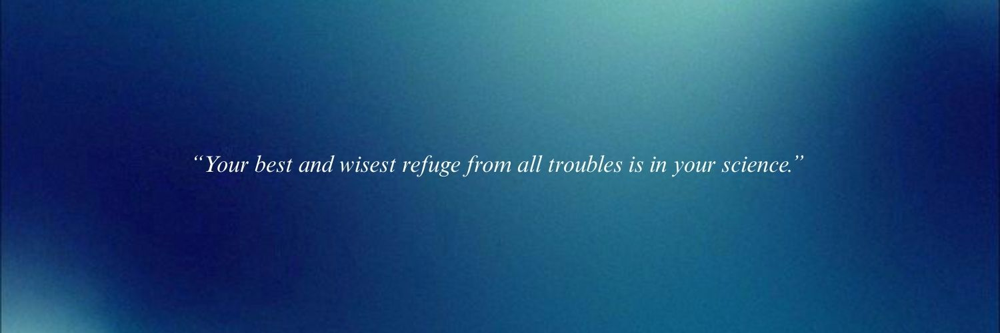

  

  
   
  

I'm a **Systems Analysis and Development** student at **SENAI** with a passion for clean code, elegant design, and problem-solving.  
I transform ideas into digital solutions with creativity, precision, and care.  

> _“There's a force stronger than nature, keeps her will alive”_

---

## 🌸 About Me

- Curious, innovative, and constantly learning  
- Passionate about coding, design, and UX/UI  
- Focused on building projects that are functional, beautiful, and maintainable  

---

## 💻 Tech Stack

  
  
  
  
  
  
  
  
  
  
  
  

---

## 📊 GitHub Stats

  
  
  

---

## 💼 Featured Projects

  
  

---

# 👋 Hi, I'm Gabriela

  

I'm a **Systems Analysis and Development** student at **SENAI** with a passion for clean code, elegant design, and problem-solving.  
I transform ideas into digital solutions with creativity, precision, and care.  

> _“There's a force stronger than nature, keeps her will alive”_

---

## 🌸 About Me

- Curious, innovative, and constantly learning  
- Passionate about coding, design, and UX/UI  
- Focused on building projects that are functional, beautiful, and maintainable  

---

## 💻 Tech Stack

  
  
  
  
  
  
  
  
  
  
  
  

---

## 📊 GitHub Stats

  
  
  

---

## 💼 Featured Projects

  
  

---

# 👋 Hi, I'm Gabriela

  

I'm a **Systems Analysis and Development** student at **SENAI** with a passion for clean code, elegant design, and problem-solving.  
I transform ideas into digital solutions with creativity, precision, and care.  

> _“There's a force stronger than nature, keeps her will alive”_

---

## 🌸 About Me

- Curious, innovative, and constantly learning  
- Passionate about coding, design, and UX/UI  
- Focused on building projects that are functional, beautiful, and maintainable  

---

## 💻 Tech Stack

  
  
  
  
  
  
  
  
  
  
  
  

---

## 📊 GitHub Stats

  
  
  

---

## 💼 Featured Projects

  
  

---

## 📫 Contact Me

  <a href="mailto:gabibuenorosa445@gmail.com">📧 Email</a> | 
  <a href="https://instagram.com/_bibueno">📸 Instagram</a>

